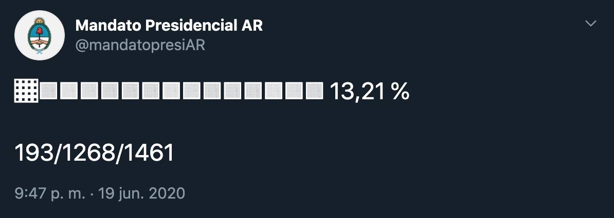

# Term Progress

This screenshot shows an example tweet. The bottom numbers display the term's *elapsed days* / *days left* / *total days*.

## What is it?
Term Progress is a Twitter bot written in `C#`/`.NET Core` and inspired by `@year_progress` that periodically creates tweets with information about public officials' terms advance status. It was created originally for `@mandatopresiAR`, to track the argentine presidential term, but it can be extended to any public official tenure.

## What structure has it?
It's designed as a web API that listens to incoming status creation requests, and a worker (Azure Function) responsible for making those requests on a time schedule.

## How can I make my own Term Progress bot?
1. Get a Twitter dev account on [https://developer.twitter.com/](https://developer.twitter.com/).
   
2. Set the following environment variables on your `TermProgress.WebAPI` production environment:
   1. `ApplicationOptions:ApiKey`: the API key.
   2. `TwitterClientConfiguration:AccessToken`: your Twitter access token.
   3. `TwitterClientConfiguration:AccessTokenSecret`: your Twitter access token secret.
   4. `TwitterClientConfiguration:ConsumerKey`: your Twitter consumer key.
   5. `TwitterClientConfiguration:ConsumerSecret`: your Twitter consumer secret.

3.  Set the following values on `TermProgress.WebAPI/appsettings.json`:
    1.  `Culture`: Set the desired culture that will be used on tweet generation. By default, it is `es-AR`.
    2.  `StartingDateTime`: set a date and time corresponding to the first day of the term. For example, if the term you would like to track starts on January, 1st, 2021, you should set the value to `2021-01-01T00:00:00`.
    3.  `EndingDateTime`: set a date and time corresponding to the midnight after the last day of the term. For example, if the term you would like to track ends on December, 31st, 2021, you should set the value to `2022-01-01T00:00:00`.

4. Set the following environment variables on your `TermProgress.Functions` production environment:
   1. `ApplicationOptions:ApiKey`: the API key; must be the same as the one you set on your `TermProgress.WebApi` `ApplicationOptions:ApiKey` environment variable.
   2. `ApplicationOptions:PublishingEndpointUrl`: your publishing endpoint URL. By default, it is `yourdomain.com/api/v1/termprogress/twitter`.

**You should set your worker function as a timer triggered every midnight.**

## Software license
This software is licensed under the [GNU General Public License v3.0](./LICENSE.md).